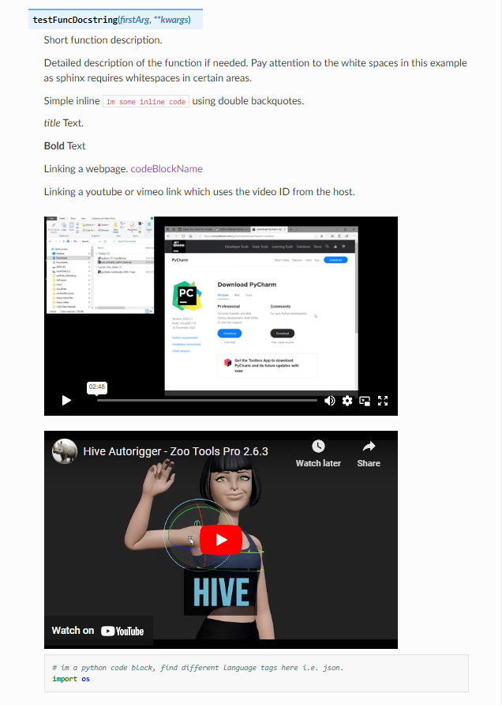
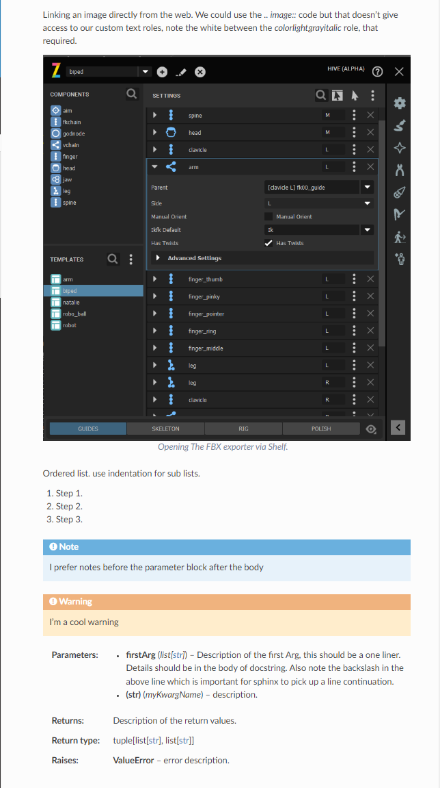

Writing Documentation
#####################

Building documentation
----------------------

Zoo Tools allows for generating a single static html page for all of Zoo tools including custom packages.

Before building the documentation you'll need to install the following::

        sphinx
        sphinx_rtd_theme
        sphinxcontrib-youtube
        sphinx-tabs

You can install these libraries using pip, zoo tools docs should be compatible with the latest version.::

 pip install  sphinx sphinx_rtd_theme sphinxcontrib-youtube sphinx-tabs

When running any of the below commands you should be using a shell ie. bash, cmd, powershell.

.. _generationApiDocs:

Pre-generating all module api docs
----------------------------------

.. note::
    This section isn't needed if you just want to build the offline docs and you're not creating docs for a
    new package.

The first time you setup documentation for your package instead of creating all the .rst files manually
from scratch you can use sphinx autodoc.

To generate rst files for one or multiple packages::

     zootoolsRoot/install/core/bin/zoo_cmd generateDocs --packages myPackageA myPackageB --apiDocs

To generate rst files into a temp folder to avoid clashing with existing custom formatted files
use the flag "--apiDocsOutputName test"::

     zootoolsRoot/install/core/bin/zoo_cmd generateDocs --packages myPackage --apiDocs --apiDocsOutputName test

To generate rst files for all packages for production use::

     zootoolsRoot/install/core/bin/zoo_cmd generateDocs --packages * --apiDocs

Building Html documentation
---------------------------

Once you've setup your packages and generated the rst files(if need be) you just run the below::

    zootoolsRoot/install/core/bin/zoo_cmd generateDocs --packages * --build --launch

Setting up a package for documentation
--------------------------------------

To setup documentation for a package you first need to tell zootools where in your package
your docs are located.

First open your zoo_package.json and add the documentation entry like the example below.
Note you should change the paths to match your package.

Example zoo_package.json entry for specifying custom documentation.

.. code-block:: json

    "documentation":
    {
        "sourceFolder": "{self}/docs/source",
        "masterDoc": "index.rst",
        "sourceCodeFolder": "{self}/zoo",
        "configScript": "{self}/docs/startupScript.py"
    }

Explanation of documentation variables

+------------------+----------------------------------------------------------------------+
| sourceFolder     |  The folder path within the package which contains all .rst files.   |
+------------------+----------------------------------------------------------------------+
| masterDoc        |  The base name of the master rst file for the package. ie. index.rst |
+------------------+----------------------------------------------------------------------+
| sourceCodeFolder |  The path to the source code ie. {self}/zoo                          |
+------------------+----------------------------------------------------------------------+
| configScript     |  The sphinx conf.py which will update or override our config         |
+------------------+----------------------------------------------------------------------+

That's it now you can follow the instructions for building the documentation see :ref:`generationApiDocs`.

Mocking third party libraries for documentation
-----------------------------------------------

There comes a time when you need to import third party modules which the documentation generator process will
not have access too ie. maya, blender etc. This is where per package "configScript" package variable comes into
play, this script is run after our internal zoo sphinx config is run this means you have the ability to
override our config using standard sphinx conf syntax, Please see official Sphinx Documentation.
We do provide a simple mock object for you to use for your modules, this module can be access via the globals

# my custom config script

.. code-block:: python

    sys.modules.update((mod_name, MockExt()) for mod_name in {"maya.cmds", "maya"}

We've already mocked all Qt modules you shouldn't need to do these. If you include zoo_maya when generating
documentation then all maya modules we also be mocked already for you.

Python Docstring examples
-------------------------

Zoo tools uses reStructured Text formatting for a docstring. The below provides some basic examples on formatting
options.

For better examples on what you can do with sphinx i have found the below links to work well.

#. `Guidelines and tips <https://sublime-and-sphinx-guide.readthedocs.io/en/latest/index.html>`_
#. `Sphinx RTD tutorial docstrings <https://sphinx-rtd-tutorial.readthedocs.io/en/latest/docstrings.html>`_

.. code-block:: python

    def testFuncDocstring(firstArg, **kwargs):
        """Short function description.

        Detailed description of the function if needed.
        Pay attention to the white spaces in this example as sphinx requires whitespaces in certain areas.

        Simple inline ``Im some inline code`` using double backquotes.

        *title* Text.

        **Bold** Text

        Linking a webpage.
        `codeBlockName <https://sublime-and-sphinx-guide.readthedocs.io/en/latest/code_blocks.html>`_

        While i don't recommend linking videos or image directly in docstrings but in the .rst docs instead however
        for completion sake.
        Linking a youtube or vimeo link which uses the video ID from the host.

        .. vimeo:: 496582963
        .. youtube:: LM9bqygCiE0

        .. code-block:: python

            # im a python code block, find different language tags here i.e. json.
            import os

        Linking an image directly from the web. We could use the `.. image::` code but that doesn't give access
        to our custom text roles, note the white between the `colorlightgrayitalic` role, that required.

        .. figure:: https://create3dcharacters.com/zoo-dev-documentation/_images/hiveartistui.png
            :align: center
            :figclass: align-center

            :colorlightgrayitalic:`Opening The FBX exporter via Shelf.`

        Ordered list. use indentation for sub lists.

        #. Step 1.
        #. Step 2.
        #. Step 3.

        .. note::
            I prefer notes before the parameter block after the body

        .. warning::
            I'm a cool warning

        :param firstArg: Description of the first Arg, this should be a one liner. Details should be in the body of \
                         docstring. Also note the backslash in the above line which is important for sphinx to pick \
                         up a line continuation.
        :type firstArg: list[str]
        :keyword  myKwargName (str): description.
        :return: Description of the return values.
        :rtype: tuple[list[str], list[str]]
        :raise ValueError: error description.
        """
        pass

Html output of the above looks line.

