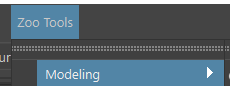

Main Menu
#########

.. figure:: ./resources/mainmenus.png
    :align: center
    :alt: alternate text
    :figclass: align-center

Here we'll walk through how menus are constructed via json. If you would like to see how these align to
you're plugins then please check out :ref:`Plugin Creation <plugincreation>`

Just like with the shelf we use a `.layout` json formatted file.
You can reuse the same plugins in the menus as you do with shelf making it quite straightforward
to setup.

Once you create a `.layout` file and you've defined a layout then in your zoo_package.json file append
the below environment variable under the environment section.

.. code-block:: json

    },
    "ZOO_MENU_LAYOUTS": ["tools/layouts/mytools_menu_layout.layout"]
    }

Now lets check out what the layout file can look like.

.. code-block:: json

    {
        "sortOrder": 900,
        "menu": [
        {
            "label": "Modeling",
            "type": "menu",
            "children": [
                {
                    "id": "zooMirrorGeo"
                    "type": "toolset"
                },
                {
                    "id": "zoo.nodes.Aligner"
                }
            ]
        }
    ]
    }

With the above you can see it's quite straightforward.
At the root of the file we have two keys, "sortOrder" and "menu"

.. code-block:: json

    {
        "sortOrder": 0,
        "menu": []
    }

Only the menu key is required here, if sortOrder isn't defined then it will be set to 0 by default.
Sorting is done in ascending order so the lower the number the closer the menu will be to the main menu
bar of the DCC.

The menu key is a list of dicts which define how you're menu will be displayed see below.

.. code-block:: json

    {
        "label": "Modeling",
        "type": "menu",
        "children": []
    }

The above describe a single menu called "Modeling" with a sort order of 0 so it would show up like so.

The "type" key is quite special as it tells the palette what to generate in this case its a "menu" type
but you'll find out further down that there's support for a few others.

The "children" key is a list of dicts in the same way that we've described above for a menu but lets have a
look at how to add actions.

.. code-block:: json

    "children":[
            {
                "id": "zooMirrorGeo"
                "type": "toolset"
            }
    ]

There's two important keys here for an action though there's more when overriding defaults but we'll get to that.

The "id" key is the id of the plugin of type toolset to use.
The "type" key in this case tells the palette to search our Toolsets plugin registry for the toolset by the "id"
key.

With this we've setup a single menu with an action but lets explorer more types for an action.

Heres the 3 types you can use at the moment for an action.

#. toolset , requires the "id" and "type" keys

    .. code-block:: json

        {
            "id": "zooMirrorGeo"
            "type": "toolset"
        }

#. definition, requires the "id" and "type" keys. See ToolDefinition for how to create these.

    .. code-block:: json

        {
            "id": "zooMirrorGeo"
            "type": "toolset"
        }

#. separator, only requires the "type": "separator" used for visualising a separation between actions or menus.

    .. code-block:: json

        {
            "type": "separator"
        }
