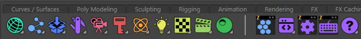

Shelves
#######

Here we'll walk through how shelves are constructed via json. If you would like to see how these align to
you're plugins then please check out :ref:`Plugin Creation <plugincreation>`

The shelve are built using a json file with the extension ".layout" just like our menus.
The json file is to design the layout of each shelf, what tools are displayed
their icons and if a shelf button contains a popup menu.

Just with the menus once you create a `.layout` file and you've defined a layout
then in your zoo_package.json file append the below environment variable under the environment section.

.. code-block:: json

    },
    "ZOO_SHELF_LAYOUTS": ["tools/layouts/mytools_shelf_layout.layout"]
    }

Simple Example of a layout file:
--------------------------------

.. code-block:: json

    {
      "sortOrder": -1,
      "shelves": [
        {
          "name": "ZooToolsPro",
          "children": [
            {
              "id": "zoo.shelf.dev",
              "displayLabel": false,
              "icon": "devMenu_shlf",
              "children": [
                {
                  "type": "toolset",
                  "id": "zooIcons"
                }
                ]
            }
        }]
    }

Example using a popup Menu.
--------------------------------

.. code-block:: json

    {
    "id": "zoo.maya.connect.selection.localsrt",
    "type": "command",
    "displayLabel": false,
    "icon": "",
    "variants": [
        {
            "name": "Connect_srt",
            "label": "Connect SRT",
            "icon": "",
            "arguments": {
                "translate": true,
                "rotate": true,
                "scale": true
            }
        }
        ]
    }

Description of each key
--------------------------------

+---------------------+-------+----------------------------------------------------------+
|        Key          | Type  |                     Description                          |
+=====================+=======+==========================================================+
| id                  |  str  | the command or definition id specfied on the class       |
+---------------------+-------+----------------------------------------------------------+
| type                |  str  | The Type of tool, either command or tooldefinition       |
+---------------------+-------+----------------------------------------------------------+
| displayLabel        |  str  | The Ui label for the action                              |
+---------------------+-------+----------------------------------------------------------+
| icon                |  str  | The icon in the zootools library to use ie. "arrow"      |
+---------------------+-------+----------------------------------------------------------+
| variants            |  list | A list of dicts in the same form as above                |
+---------------------+-------+----------------------------------------------------------+
| arguments           |  dict | extra arguments to pass to the tooldefinition or command |
+---------------------+-------+----------------------------------------------------------+

