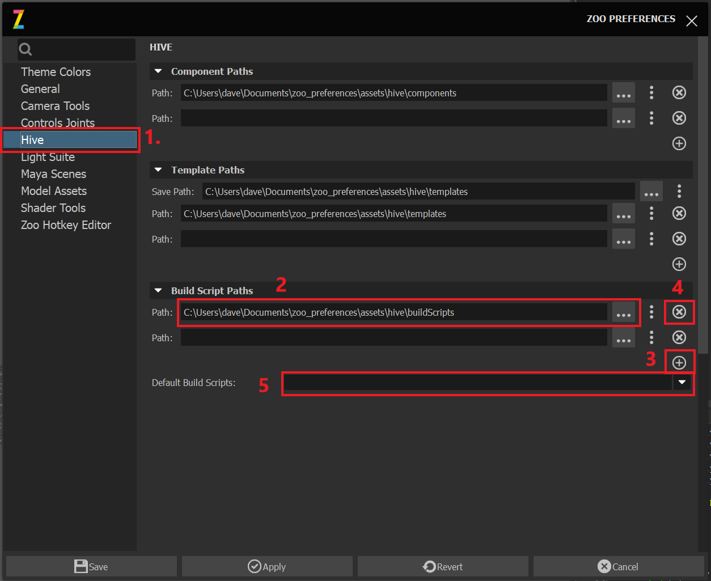
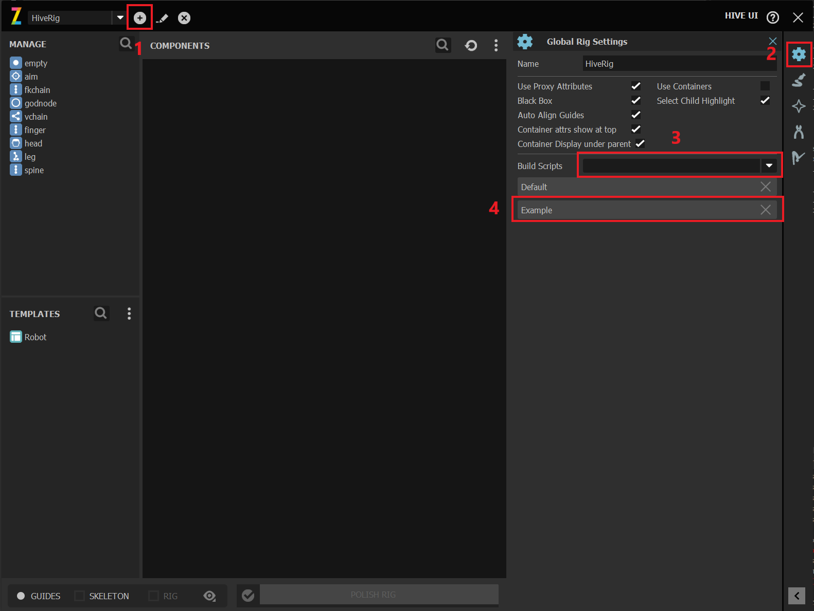
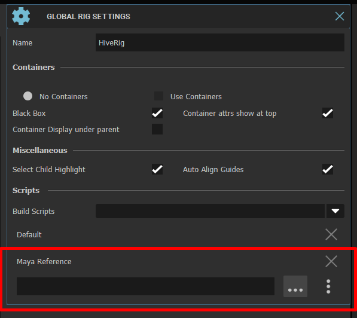

.. _buildscripting-reference:

Build Scripting
####################################################

.. toctree::
   :maxdepth: 3

   ./buildscripting_examples

Hive build-scripting allows a user to run custom python code during each build stage.
These build-scripts will also be saved into the rigs configuration so when the
rig loaded at a later time this scripts will be loaded once more.

Each build-script is setup as a plugin which will be discovered by Hive when Hives configuration is loaded.

For code examples see :ref:`Examples <buildscripting_example-reference>`.

Setting Up A Build Script
####################################################
Let's setup a build script.

First lets tell hive where to find our plugin.
There's two approaches to setting up paths both work together but are designed for
different purposes.

#. Adding to the environment variable `HIVE_BUILD_SCRIPTS_PATH`, this environment
    variable is mainly for studios where they want to force a centralized set of paths to be
    used by the user.

#. Per user setting and this is in the user preference UI.

For this example we'll modify the user preferences.

|

#. Open the user preferences and go to the hive section.
#. Either click the browser button or manually enter the path.
#. Click the plus icon button right to add more paths.
#. Click the X button to remove a path.
#. If you would like to add the plugin as a default select it from the drop down once you create the plugin.

Now lets create a build script plugin and add it to our rig.

First create a python file under your specified folder which you added to the user preferences.

In my case i'll create it under `zoo_preferences/assets/hive/buildScripts`

Now copy paste the below stub code then change the class name and Id.

.. code-block:: python

    from zoo.libs.hive import api

    class ExampleBuildScript(api.BaseBuildScript):
        """

        .. note::

            Best to read the properties method in the base class :func:`api.BaseBuildScript.properties`

        """
        # unique identifier for the plugin which will be referenced by the registry.
        id = "example"

        def preGuideBuild(self, properties):
            """Executed Before Any guide has been build on the rig
            """
            pass

        def postGuideBuild(self, properties):
            """Executed once all guides on all components have been built into the scene.
            """
            pass

        def preDeformBuild(self, properties):
            """Executed before the deformation layer has been built or updated for all components.

            This is the ideal point in the process to export skin weights if the skeleton
            already exists.
            """
            pass

        def postDeformBuild(self, properties):
            """ Executed after the deformation and I/O layers has been built for all components
            including all joints.

            This is ideal point in the process to reimport skin weights if necessary.
            """
            pass

        def preRigBuild(self, properties):
            """Executed before the rig Layer has been built for all components.
            """
            pass

        def postRigBuild(self, properties):
            """Executed after the rig Layer has been built for all components.
            """
            pass

        def postPolishBuild(self, properties):
            """Executed after the polish stage.

            Useful for building space switching, optimizing the rig, binding asset meta data and
            preparing for the animator.
            """
            pass

        def preDeleteGuideLayer(self, properties):
            """Executed before the guides of the rig gets deleted.
            """
            pass

        def preDeleteDeformLayer(self, properties):
            """Executed before the deform layer of the rig gets deleted.

            .. Note::

                This is pretty rare unless done directly through the API as we don't provide
                deletion currently to the end user.
            """

            pass

        def preDeleteRigLayer(self, properties):
            """Executed before the rig layer of the rig gets deleted.
            """
            pass

        def preDeleteComponents(self, properties):
            """Executed before all components gets deleted on the rig.

            .. Note::

                This method does get run when rig.deleteComponent get run use :func:`preDeleteComponent`

            """
            pass

        def preDeleteComponent(self, component, properties):
            """Executed before a single component gets deleted.

            .. Note::

                This method does get run when rig.deleteComponents get run use :func:`preDeleteComponents`

            """
            pass

        def preDeleteRig(self, properties):
            """Executed when the entire hive rig gets deleted.

            .. Note::

                :func:`preDeleteComponents` gets run before this method.

            """
            pass

Now you can either reload the preferences window and do step 5 above or load up the hive artist UI
and follow the below instructions.

|

#. Add a new rig or load an existing one.
#. Select the rig config icon.
#. Select your new plugin from the drop down.
#. The selected plugin will now display in the list. Click the X button to remove it.

.. note::
    If you had set default scripts in the user Preferences they'll be displayed here as well but
    can't be removed per rig as the user preferences acts as the global.

BuildScript Properties
----------------------

At times there's going to be a need to pass properties to a build script ie. Loading Maya reference.

This is what the :func:`Properties<zoo.libs.hive.base.buildscript.BaseBuildScript.properties>` is for.

This defines properties include UI layout and property type that way Hive UI can generate the UI.

Here's an example of our built in Maya Reference build script.

    :colorlightgrayitalic:`Here's the properties definition in python`

.. code-block:: python

    @staticmethod
    def properties():
        return [{"name": "filePath",
                 "value": "",
                 "type": "filePath",
                 "layout": [0, 0]}
                ]

You can then access the filePath property in the buildScript pre/post methods like so.

Special mention is the layout key which is the column,row for the widget in the grid layout.

At this current time we only support the following property types

#. filePath
#. string
#. boolean

.. code-block:: python

    def preDeformBuild(self, properties):

        filePath = properties.get("filePath", "")
        if not os.path.exists(filePath):
            output.displayWarning("Requested Maya Skeletal Reference but specified File Path doesn't exist. Skipping")
            return

It's your responsibility to handle invalid property values.