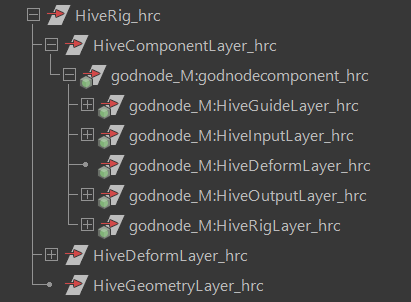
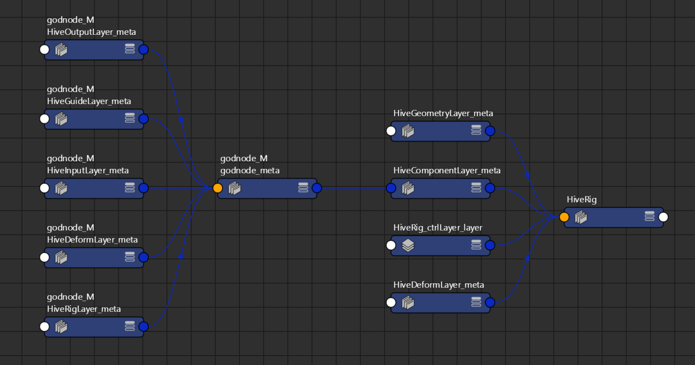
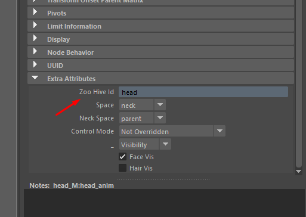

.. _component-reference:

Components
####################################################

.. contents:: Table of Contents
   :local:
   :depth: 2

Components are individual isolated rigs that make up one larger rig eg. arm, leg, eye etc which makes
up a character/prop/setPiece.

Rigging Components are built with modularity in mind this means that if a particular set of logic
can be reused then we should consider it to be a component and we attach it to other components.

We Provide Some out of box components for the most common use cases and will continue to add more
as we go.

API Reference: :class:`zoo.libs.hive.base.component.Component`

Component Scene Structure
********************************

Components and the API are designed with a :ref:`Organizational layering <hiveLayers-term>` concept.

Each layer within a component contains all required functionality includes nodes and attributes.

The below is the maya DAG representation of layers both at the rig Level and the component Level.

The Below Represents the our Hive Meta node Network from Rig to component Layers

Hive Component File structure
*****************************

For every Hive component there's two files.
    #. :ref:`Python file <componentPythonFile>`
    #. :ref:`Definition <definition>`

How you structure you're folder structure is up to you however it's important to set
a couple of environment variables to correctly discover these files.

    #. HIVE_COMPONENT_PATH
    #. HIVE_DEFINITIONS_PATH

See Description of these and more here :ref:`hiveEnvironmentVariables`

.. _definition:

Definition
****************

The definition is nothing fancy it's just a really big python dictionary representing your component but we'll
still break it down in the following sections so it's easier to digest and understand what each section
is responsible for.

:ref:`Definition <definition-term>` files describe the components in the rawest possible way which allows
hive to generate Scene Nodes and attributes without the need for the client(You) to code and take into
account of to many details. Definitions are the back bone of a component they are stored in the scene and
a small subset of the definition is also saved inside templates.

The definition is created, manipulated and saved(stored in scene only) during all build stages, it can
also be inspected and manipulated from the outside via the API but you'll need to run a rebuild for it
to take an effect in the scene.

Definition Types
================

There are multiple definition types which are used to represent nodes, hive layers and attributes.

Lets start with :ref:`Guides <guide-term>`.

API Class :class:`zoo.libs.hive.base.definition.GuideDefinition`

The below represents a fully formed Guide Node it contains every bit of scene data required to recreate
the guide.

.. code-block:: json

    {
                "rotateOrder": 2,
                "parent": null,
                "shape": "godnode",
                "hiveType": "guide",
                "scale": [1,1,1],
                "shapeTransform": {
                    "translate": [0,0,0],
                    "rotate": [0,0,0,1],
                    "scale": [1,1,1]
                },
                "id": "godnode",
                "matrix": [1,0,0,0,0,1,0,0,0,0,1,0,0,0,0,1],
                "rotate": [0,0,0,1],
                "name": "godnode",
                "srts": [],
                "children": [],
                "worldMatrix": [1,0,0,0,0,1,0,0,0,0,1,0,0,0,0,1],
                "attributes": [],
                "translate": [0,0,0],
    }

Most settings for a guide node don't require an explanation ie. rotateOrder, however there are some
that require some notes. At the same time Hive creates defaults for settings.

 * parent: Strictly the unique id for the parent node, if it's not set then the parent will be the root node.
 * shape: Either the shape name which exists in our :ref:`Shape Library <shapelib-ref>` or the serialized form of the shapenodes.
 * shapeTransform: Transform for the shape node.
 * srts: Srts are simply a transform which are placed above the guide with the same worldspace Transform.
 * children: This contains all child guides each being a GuideDefinition.
 * id: Unique Identifier for the guide relative to the guideLayer.

Next on the table is the :class:`zoo.libs.hive.base.definition.JointDefinition`

Joint Definition is pretty much the same as the guide just without the shape info.

.. code-block:: json

    {
      "name": "upr_srt",
      "parent": null,
      "attributes": [],
      "rotate": [0,0,0,1],
      "translate": [0,0,0],
      "scale": [1,1,1],
      "rotateOrder": 0,
      "matrix": [1,0,0,0,0,1,0,0,0,0,1,0,0,0,0,1],
      "worldMatrix": [1,0,0,0,0,1,0,0,0,0,1,0,0,0,0,1],
      "id": "upr",
      "hiveType": "joint",
      "children": []
    }

.. _inputDefinition:

Next on the table is the :class:`zoo.libs.hive.base.definition.InputDefinition`

.. code-block:: json

     {
        "rotateOrder": 2,
        "rotate": [0,0,0,1],
        "name": "godnode",
        "parent": null,
        "translate": [0,0,0],
        "children": [],
        "id": "godnode",
        "root": true,
        "hiveType": "input"
    }

Next on the table is the :class:`zoo.libs.hive.base.definition.OutputDefinition`

.. code-block:: json

    {
        "rotateOrder": 2,
        "rotate": [0,0,0,1],
        "name": "godnode",
        "parent": null,
        "translate": [0,0,0],
        "children": [],
        "id": "godnode",
        "hiveType": "output"
    }

Attributes
**********
Currently we have a single generic :class:`AttributeDefinition<zoo.libs.hive.base.definition.definitionattrs.AttributeDefinition>`
though we're likely to extend this for all attribute Types in the near future.

We support a wide variety of maya attribute types which you can see :mod:`zoo.libs.maya.api.attrtypes`
This include support for arrays and compounds.

.. code-block:: json

    {
                "isArray": false,
                "locked": false,
                "name": "hasStretch",
                "min": 0,
                "default": false,
                "max": 1,
                "value": true,
                "softMax": null,
                "isElement": false,
                "channelBox": true,
                "softMin": null,
                "Type": 0,
                "keyable": false,
                "children": []
    }

Unique Identifiers
******************
Hive API doesn't rely on node naming instead we rely on Unique Identifiers or "id" for short which live on the node
and as part of the hive node network.

A Nodes Hive id has a very important role and without Ids being setup correctly per component hive API will not
operate in the expected way. The first thing to know is that Id's are relative to the components Layer and node type.
This means that the same ID can be used between different layers on the same component, in fact this is recommended and
as we explain below this is required.

With the above explanation of the :ref:`Definition <definition>` you'll find that each definition node type contains the
"id" flag at the same time every hive node in the scene contains the ID attribute either on the node or on the connected
meta node. All Hive operations operate off Ids not node names.

    :colorlightgrayitalic:`Here's where you can find the id of a node in Mayas AttributeEditor`

Let's look at one of the most important sections to the build system and how ID matching plays an important role.

When we are in Guide mode we create constraints between two guides the child component which uses the root guide
and the parent component which uses the exact chosen guide. However when we switch to the skeleton or deform mode
these constraints need to be recreated so our rig controls get constrained correctly and our bind skeleton
has the correct parent joint.

Between mode switching hive serializes these user constraints using the ids and maps them
to the Input and Output Layer transforms which have the same ID as the guides once mapped these constraints are
recreated constraining the input and output transforms ultimately driving the child component.

Lets look at how the Dag Nodes map to Ids::

    |- arm_hrc
        |- guideLayer_hrc
            |- rootGuide_srt
                |- rootGuide  # id: root
                    |- upr_guide_srt
                        |- upr_guide  # id: upr
        |- inputLayer_hrc
            |- upr_in     # id: upr  , marked as the primary root input in the definition
        |- outputLayer_hrc
            |- upr_out    # id: upr
        |- deformLayer_hrc
            |- upr_srt    # id: upr

As you can see above we have matching Ids for nodes where the guide needs to match between I/O layers, deform and guide.
But you'll also note that the root Guide has no I/O node, this is because the root guide is only for manipulating
a group of guides during user interaction but won't exist in other layers. It's also important to note that the
:ref:`InputDefinition <inputDefinition>` node contains  key "root: true" marking that node to be used for constraining
when the component is the child.

Lets take a look at how you can use Ids to query the component

.. _componentPythonFile:

Python Files
************
Pretty straight forward but these have a single class which inherits from the base component class or other
components.

Their job is to build the component and its' contents. We can use the :ref:`Definition <definition>` to
cut down how much code we need to write when were build static component data.

When designing your component you can use hive to prototype your component before serializing
out the generated definition to a file, currently we are restricted to certain nodes and we don't
serialize the rig DG network itself so it's still necessary to create the component class.

An Example of prototyping a component with the api before serializing and saving the
definition file.

.. code-block:: python

    from zoo.libs.hive import api
    from zoo.libs.utils import filesystem
    # rig instance
    myRig = api.Rig()
    # Creates the metanode and root for the rig
    myRig.startSession("rigName")
    # empty component for prototyping, replace with yours if you have one
    custom = rig.createComponent("empty", "custom", "M")
    # create the guideLayer
    guideLayer = custom.getOrCreateLayer(api.constants.GUIDE_LAYER_TYPE)
    # build a guide and attach it to the layer
    customGuide = guideLayer.createGuide(**{"id": "customId", "name": "jaw",
                    "shape": "circle", "translation": (0.0,0.0,0.0),
                    "rotation": (0.0,0.0,0.0), "rotationOrder": 0,
                    "shapeTransform":{"translation": (0.0,0.0,0.0),
                    "rotation": (0.0,0.0,0.0,1.0),
                    "rotationOrder": 0, "scale": (1.0,1.0,1.0)}}
    )

    # Lets add guide settings
    # Hive does this on dedicated nodes for guides only one node is needed and will
    # ever be created by hive no matter how many you create via the api, at build time
    # of the* guides all settings are merged into one node.
    settingNode = guideLayer.createSettingsNode(name="Guide_Settings")
    settingNode.addAttribute("MyAttribute", api.attrtypes.kMFnNumericFloat,
                                      value=0.0, default0.0)
    # ok so we have done what we want so now we need to create the serialized form of the
    # guides
    definition = jaw.serializeFromScene()
    # lets save it to a location so it can be referenced when we create the component class.
    file.saveJson(definition, "somefile.definition")

    # You can also pprint to definition
    definition.pprint()

The Above definition generates the below

.. code-block:: json

    {
        "guideLayer": {
          "dag": [
            {
              "name": "root",
              "shape": "...",
              "id": "root",
              "children": [
                {
                  "name": "customId",
                  "shape": "...",
                  "id": "customId",
                  "children": [],
                  "color": [],
                  "parent": "root",
                  "hiveType": "guide",
                  "translate": [0,0,0],
                  "rotate": [0,0,0,1],
                  "scale": [1,1,1],
                  "shapeTransform": {
                    "translate": [0,0,0],
                    "rotate": [0,0,0,1],
                    "scale": [1,1,1]
                  },
                  "srts": [],
                  "type": "transform",
                  "rotateOrder": 0,
                  "matrix": [1,0,0,0,0,1,0,0,0,0,1,0,0,0,0,1],
                  "worldMatrix": [1,0,0,0,0,1,0,0,0,0,1,0,0,0,0,1],
                  "pivotShape": "sphere",
                  "pivotColor": [1,1,0]
                }
              ],
              "color": [],
              "parent": null,
              "hiveType": "guide",
              "translate": [0,0,0],
              "rotate": [0,0,0,1],
              "scale": [1,1,1],
              "shapeTransform": {
                  "translate": [0,0,0],
                  "rotate": [0,0,0,1],
                  "scale": [1,1,1]
              },
              "srts": [
                {
                  "name": "root_guide_srt",
                  "type": "transform",
                  "parent": "custom_M:HiveGuideLayer_hrc",
                  "translate": [0,0,0],
                  "rotate": [0,0,0,1],
                  "scale": [1,1,1],
                  "rotateOrder": 0,
                  "matrix": [1,0,0,0,0,1,0,0,0,0,1,0,0,0,0,1],
                  "worldMatrix": [1,0,0,0,0,1,0,0,0,0,1,0,0,0,0,1]
                }
              ],
              "type": "transform",
              "rotateOrder": 0,
              "matrix": [1,0,0,0,0,1,0,0,0,0,1,0,0,0,0,1],
              "worldMatrix": [1,0,0,0,0,1,0,0,0,0,1,0,0,0,0,1],
              "pivotShape": "cube",
              "pivotColor": [0.800000011920929,0,0]
            }
          ],
          "settings": [
            {
              "isDynamic": true,
              "children": [],
              "name": "MyAttribute",
              "channelBox": false,
              "keyable": false,
              "locked": false,
              "isArray": false,
              "default": 0,
              "Type": 5,
              "value": 0,
              "isElement": false,
              "isChild": false
            }

          ],

        "inputLayer": {
          "settings": [],
          "dag": []
        },
        "name": "custom",
        "outputLayer": {
          "settings": [],
          "dag": []
        },
        "rigLayer": {
          "dag": [],
          "settings": {}
        },
        "side": "M",
        "type": "myComponent",
        "version": "1.0.0",
        "definitionVersion": "2.0",
        "deformLayer": {
          "settings": [],
          "dag": []
        },
        "parent": "",
        "connections": {},
        "path": "zoo\\libs\\hive\\library\\components\\myComponent.py"
    }

That's just one way of creating the definition while you are prototyping, one more method
is to create the json file by hand which can be faster if its a small component but larger
components will become quite unmanageable without the api.
Do we have other methods to create from the api? YES!
The Definition object gives you everything you need to create it.

Example of doing the same as above

.. code-block:: python

        from zoo.libs.hive import api
        from zoo.libs.utils import filesystem
        # rig instance
        myRig = api.Rig()
        # Creates the metanode and root for the rig
        myRig.startSession("rigName")
        # empty component for prototyping, replace with yours if you have one
        custom = myRig.createComponent("empty", "custom", "M")
        # create the guideLayer
        guideLayer = custom.definition.guideLayer
        # build a guide and attach it to the layer
        customGuide = guideLayer.createGuide(**{"id": "customId", "name": "jaw",
                        "shape": "circle", "translation": (0.0,0.0,0.0),
                        "rotation": (0.0,0.0,0.0), "rotationOrder": 0,
                        "shapeTransform":{"translation": (0.0,0.0,0.0),
                        "rotation": (0.0,0.0,0.0,1.0),
                        "rotationOrder": 0, "scale": (1.0,1.0,1.0)}, "parent": "root"}
        )

        # Lets add guide settings
        # Hive does this on dedicated nodes for guides only one node is needed and will
        # ever be created by hive no matter how many you create via the api, at build time
        # of the* guides all settings are merged into one node.
        setting= api.AttributeDefinition(name="MyAttribute", Type=api.attrtypes.kMFnNumericFloat,
                                              value=0.0, default=0.0)
        guideLayer.addGuideSetting(setting)
        myRig.buildGuides()
        # ok so we have done what we want so now we need to create the serialized form of the
        # guides

        definition = custom.serializeFromScene()
        definition["type"] = "myComponent"
        definition["path"] = "*/myComponent.definition" # change this to the appropriate path
        # lets save it to a location so it can be referenced when we create the component class.
        filesystem.saveJson(definition, "somefile.definition")
        # You can also pprint to definition
        definition.pprint()
        # or better yet save it through hive
        api.Configuration().componentRegistry().saveComponentDefinition(newDef)

Setting up the class
********************

We'll continue on from the above example by creating to most simplest component

.. code-block:: python

    from zoo.libs.hive import api
    from zoo.libs.maya import zapi

    class MyComponent(api.Component):
        creator = "David Sparrow"
        # note this is linked to the definition 'type' key
        definitionName = "myComponent"
        icon = "componentFK"

        def setupInputs(self):
            """We could create inputs directly in the definition file, avoiding the below code
            but to demo creating inputs in the case where dynamically generated nodes need to be done we'll
            create it.
            """
            definition = self.definition
            inputLayerDef = definition.inputLayer  # type: api.InputLayerDefinition
            guideDef = definition.guideLayer.customId  # type: api.GuideDefinition
            inputLayerDef.createInput(id=guideDef.id,
                                      name=self.namingConfiguration().createInputName(guideDef.id),
                                      rotateOrder=guideDef.get("rotateOrder", zapi.kRotateOrder_XYZ),
                                      translate=guideDef.translate,
                                      rotate=guideDef.rotate)  # we ignore scale from the guide.

            super(MyComponent, self).setupInputs()

        def setupDeformLayer(self, parentJoint):
            """Create all deformation joints in the definition as hive we do the scene translation for us.

            :param parentJoint: The parent components joint or the current deformLayer.
            :type parentJoint: :class:`api.Joint`
            """
            # build skin joints if any
            definition = self.definition
            deformLayerDef = definition.deformLayer  # type: api.DeformlayerDefinition
            guideLayerDef = definition.guideLayer  # type: api.GuideLayerDefinition
            guideDef = guideLayerDef.customId  # type: api.GuideDefinition
            deformLayerDef.createJoint(name=self.namingConfiguration().createRigSrtName(guideDef.id),
                                       id=guideDef.id,
                                       rotateOrder=guideDef.get("rotateOrder", zapi.kRotateOrder_XYZ),
                                       translate=guideDef.get("translate", (0, 0, 0)),
                                       rotate=guideDef.get("rotate", (0, 0, 0, 1))
                                       )
            super(MyComponent, self).setupDeformLayer(parentJoint=parentJoint)

        def setupOutputs(self, parentNode):
            """We could create outputs directly in the definition file, avoiding the below code
            but to demo creating outputs in the case where dynamically generated nodes need to be done we'll
            create it.

            :param parentNode: The parent components joint or the current deformLayer.
            :type parentNode: :class:`api.Joint`
            """
            definition = self.definition  # type: api.ComponentDefinition
            outputLayerDef = definition.outputLayer  # type: api.OutputLayerDefinition
            guideDef = definition.guideLayer.customId  # type: api.GuideDefinition
            outputLayerDef.createOutput(id=guideDef.id,
                                        name=self.namingConfiguration().createInputName(guideDef.id),
                                        rotateOrder=guideDef.get("rotateOrder", zapi.kRotateOrder_XYZ),
                                        translate=guideDef.translate,
                                        rotate=guideDef.rotate)  # we ignore scale from the guide.

            super(MyComponent, self).setupOutputs(parentNode)

        def setupRig(self, parentNode):
            """Setup rig is responsible for create all scene nodes. Hive currently doesn't auto mate any node
            creation but will create all settings in the definition.

            :param parentNode: The parent components joint or the current deformLayer.
            :type parentNode: :class:`api.Joint`
            """
            guideLayerDef = self.definition.guideLayer
            guide = guideLayerDef.guide("customId")
            rigLayer = self.rigLayer()
            inputLayer = self.inputLayer()
            guide.selectionChildHighlighting = self.configuration.selectionChildHighlighting
            rigLayer.createControl(**guide)
            srt = rigLayer.createSrtBuffer(guide.id, self.namingConfiguration().createRigSrtName(guide.id))
            # bind the input node to the controls srt
            inputNode = inputLayer.inputNode(guide.id)
            inputNode.attribute("worldMatrix")[0].connect(srt.offsetParentMatrix)

        def postSetupRig(self, parentNode):
            """ Post setup rig is used to create bindings between the rig and deform/IO nodes.

            :param parentNode: The parent components joint or the current deformLayer.
            :type parentNode: :class:`api.Joint`
            """

            rigLayer = self.rigLayer()
            control = rigLayer.control("customId")
            const = api.buildConstraint(self.outputLayer().outputNode("customId"),
                                        {"targets": ((control.fullPathName(partialName=True,
                                                                           includeNamespace=False), control),)},
                                        constraintType="matrix")
            rigLayer.addExtraNodes(const.utilityNodes())
            jnt = self.deformLayer().joint("customId")
            # bind the skeleton joint
            const = api.buildConstraint(jnt,
                                        {"targets": ((control.fullPathName(partialName=True,
                                                                           includeNamespace=False), control),)},
                                        constraintType="parent")
            rigLayer.addExtraNodes(const.utilityNodes())
            const = api.buildConstraint(jnt,
                                        {"targets": ((control.fullPathName(partialName=True,
                                                                           includeNamespace=False), control),)},
                                        constraintType="scale")
            rigLayer.addExtraNodes(const.utilityNodes())

            super(MyComponent, self).postSetupRig(parentNode)

