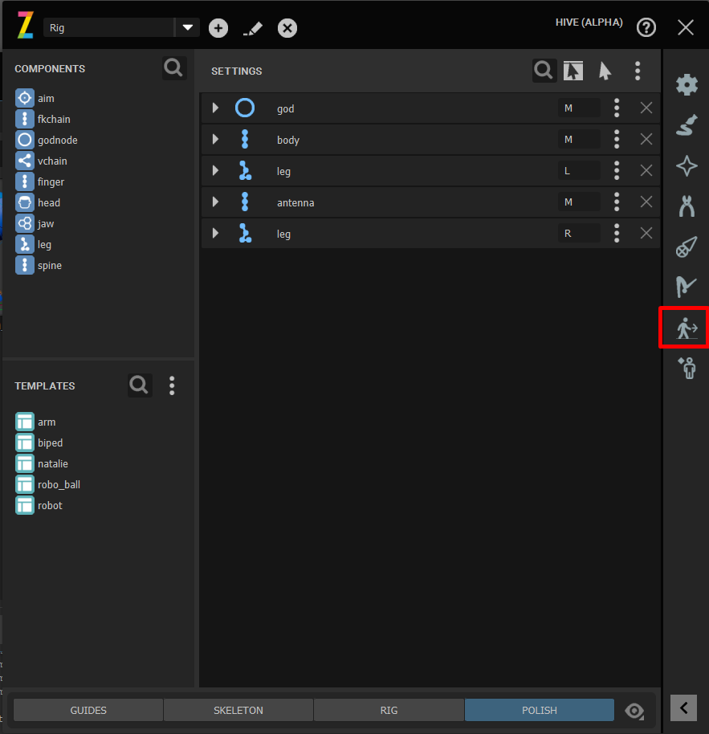
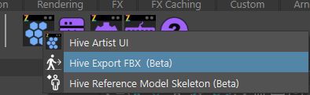
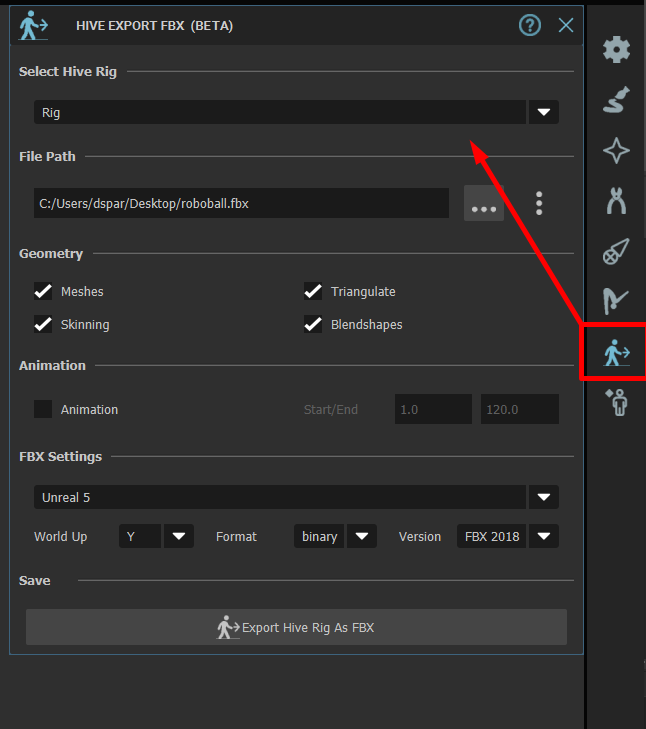
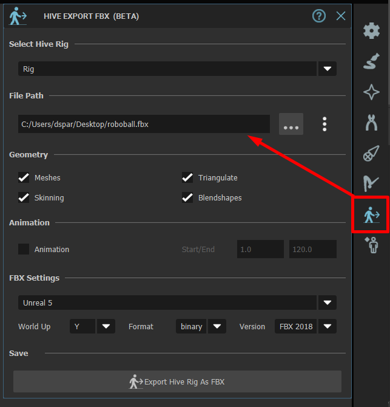
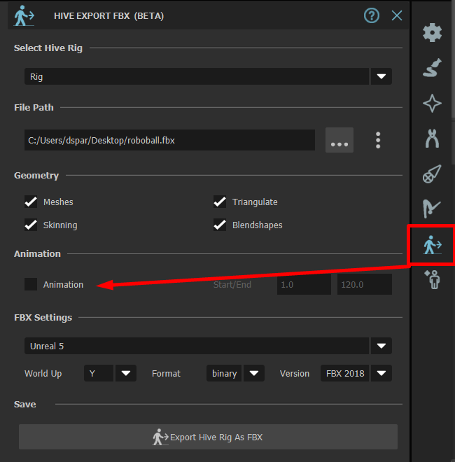
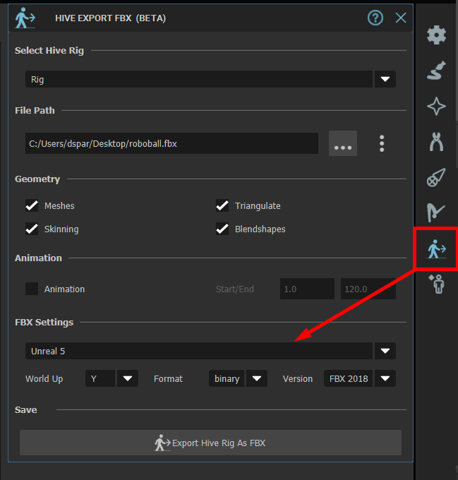
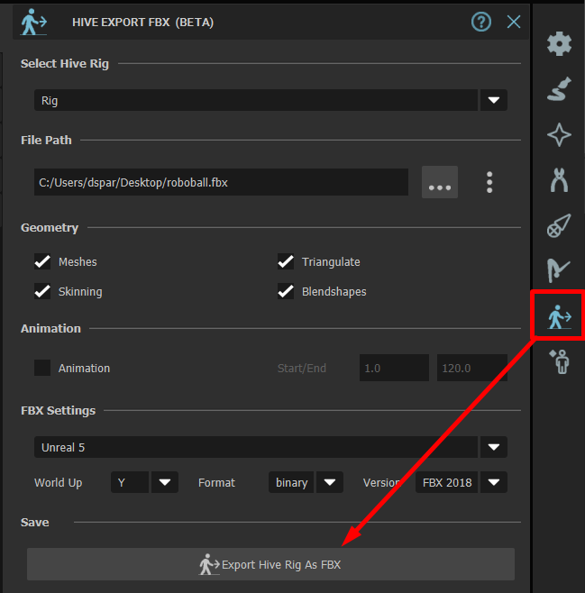
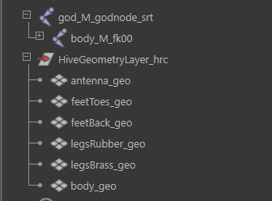

FBX Exporting Toolset
#####################

On this page we'll walk through exporting a Hive Rig as an FBX ready to import into a Game Engine.

At this current time the FBX exporter needs to support a wide array of use cases and mostly
designed for individual users. As a studio TD you can use the Hive API to automate the exports through
your own tools you can even use our fbx exporter plugin but have your own UI. See here for details
on :ref:`exporter plugins <hiveExporterPlugin>`.

Limitations
-----------

#. When exporting animation it's best to turn off skinning as it's normally not required since
   the bind pose FBX will contain this. If however this is left on it will result in a slower export
   due to the exporter needing to import references to correctly align the hierarchy to the bind pose
   before exporting and the current scene will need to  be reopened.
#. At this time all geometry within the geometry layer will be exported, we believe this is only a temporary
   solution until we build some tagging tools .

WalkThrough
-----------

Now first things first load the FBX toolset either through the Hive Artist UI or
via the Shelf.

|

    :colorlightgrayitalic:`Clicking the Human Arrow icon will open the Exporting toolset.`

|

    :colorlightgrayitalic:`Opening The FBX exporter via Shelf.`

|

Once Loaded we need to choose the Rig we want to export, If the Hive UI is already open then
the toolset will sync itself to the UI.

|

    :colorlightgrayitalic:`Select the Rig from the Dropdown`

|

The Next step is to set the Export Path for the Fbx.

|

    :colorlightgrayitalic:`Specify the .fbx export path.`

|

We're going to export just the bind pose here so we'll turn off animation.
All other default settings here should suffice for an engine export.

|

    :colorlightgrayitalic:`Turn off Animation for BindPose export`

|

Select the preset to use. The default is compatible with Unreal Engine excluding the
World Up Axis so just remember to convert the skeleton to Z up on UE import.

|

    :colorlightgrayitalic:`Select the Preset you wish to use ie. Unreal.`

|

Once you've ready to export just click Export.

|

    :colorlightgrayitalic:`Click the export Button will begin the export process.`

|

The below shows that the FBX we exported contains just the skeleton and geometry layer
parented to the world.

|

    :colorlightgrayitalic:`Contents within the exported FBX.`

|
