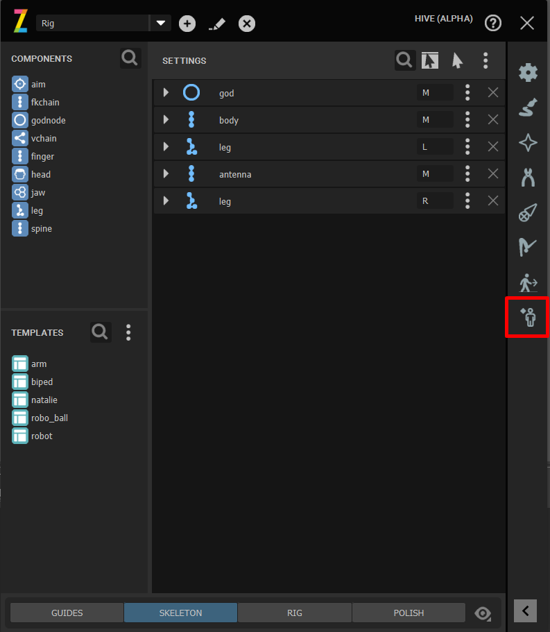
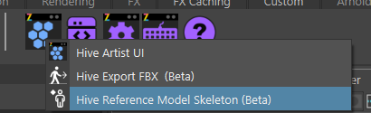
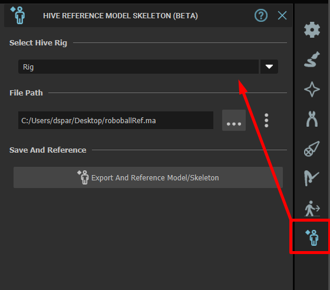
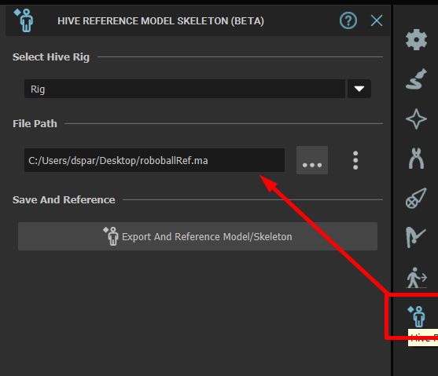
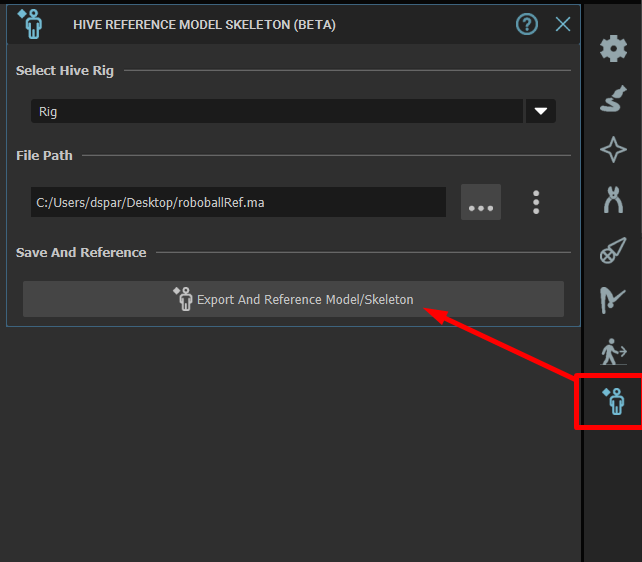
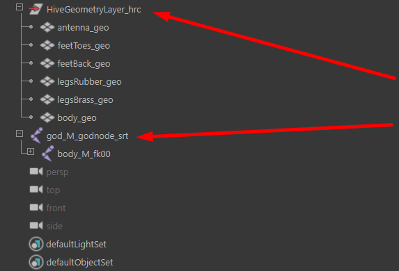
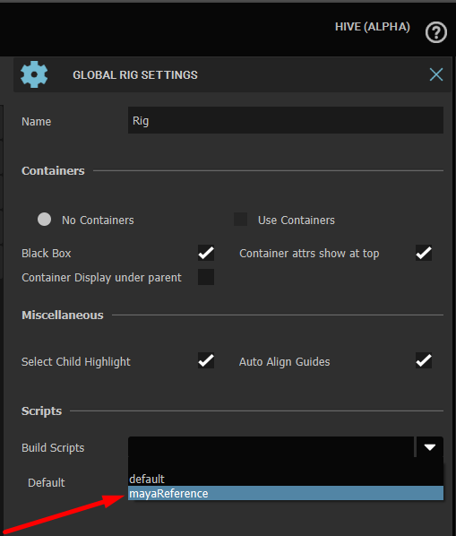
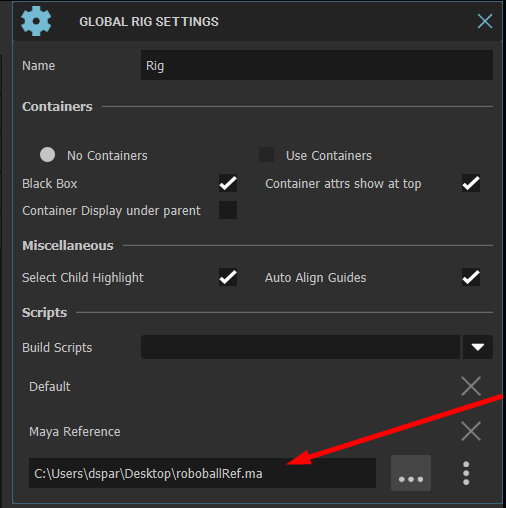
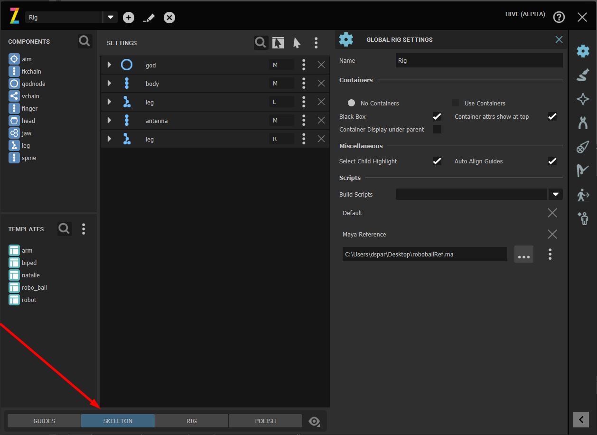
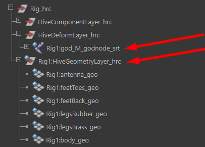

Maya Referencing Toolset
########################

On this page we'll walk through exporting and loading a maya scene as a reference
which contains the Hive skeleton and geometry.

Requirements
------------

#. The file we reference must contain a hive skeleton exported from the Tool.
#. The skeleton root must be parented to the world.
#. The geometry must be parented to a single Transform which is parented to the world.

.. Note::

    Geometry isn't necessary for the export which makes it useful when you want to share
    skeletons between rigs.

Limitations
-----------

#. The scene must meet the above requirements in terms of structure due to Hive parenting
   The skeleton and geometry into the Rig on load for organizational purposes and for tools which may
   rely on hierarchies to continue functioning.
#. Once the Reference is loaded any changes to the reference you'll need to use the Maya reference editor
   to reload the reference, hive build script doesn't do this currently.
#. The Build script won't reload or handle changing the path after the fact, this is a temporary limitation.

WalkThrough
-----------

Now first things first load the maya reference toolset either through the Hive Artist UI or
via the Shelf.

|

    :colorlightgrayitalic:`Clicking the Human icon will open the Exporting toolset.`

|

    :colorlightgrayitalic:`Opening The Maya Reference exporter via Shelf.`

|

Once Loaded we need to choose the Rig we want to export, If the Hive UI is already open then
the toolset will sync itself to the UI.

|

    :colorlightgrayitalic:`Select the Rig from the Dropdown`

|

The Next step is to set the Export Path for the Maya reference.

|

    :colorlightgrayitalic:`Specify the .ma/.mb export path.`

|

Once you've ready to export just click Export.

|

    :colorlightgrayitalic:`Click the export Button will begin the export process.`

|

Lets understand a little bit about how the export is done and what happens afterwards.

#. The existing skeleton and geometry layer will be un-parented.
#. The skeleton will then have a new string attribute created on each joint describing which component, rig and
   joint id that the joint is associated with.
#. The skeleton and geometry layer will have it's meta data disconnected from the rig.
#. The rig will be removed from the scene.
#. The export for the skeleton and geometry will be done.
#. Once completed, the scene will be reopened.
#. The rig will be updated with the mayaReference build script and exported path.
#. The existing skeleton will be deleted.
#. Finally the rig will be rebuilt with the new reference.

The below shows that the maya reference scene we exported contains just the skeleton and geometry layer
parented to the world

|

    :colorlightgrayitalic:`The content within the referenced file.`

|

The following steps is needed when you need to set the buildscript up manually eg. reuse.
Normally when we export a Reference the build script will be created and setup automatically
for you but what if you want to reuse the Maya reference on another rig which contains the
same setup.

|

    :colorlightgrayitalic:`Setting up the build script to reference our file.`

|

    :colorlightgrayitalic:`Set the path to the .ma file will just exported.`

|

    :colorlightgrayitalic:`Clicking on skeleton once more will rebuild the skeleton.`

|

    :colorlightgrayitalic:`The Loaded referenced neatly organized and linked to our rig.`

|

