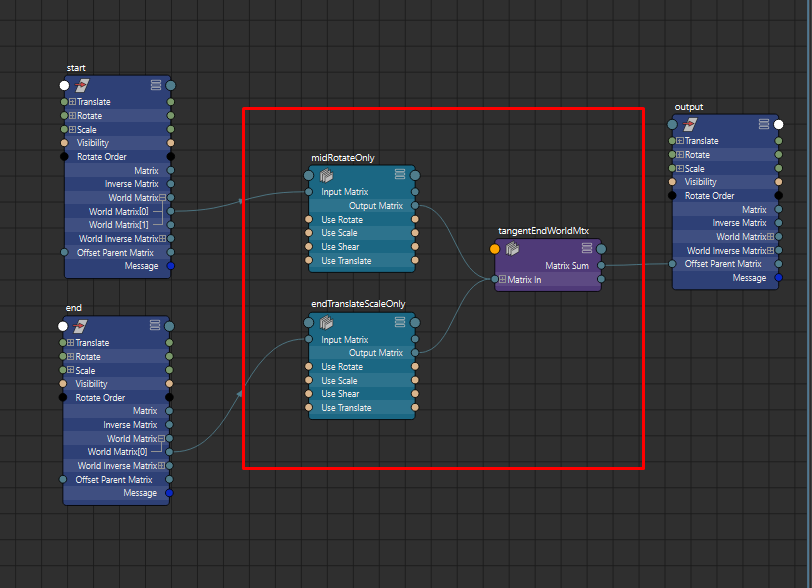
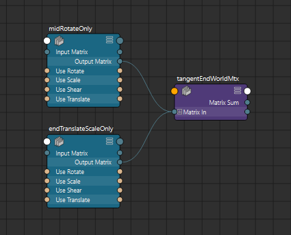
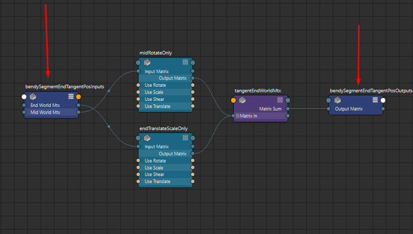
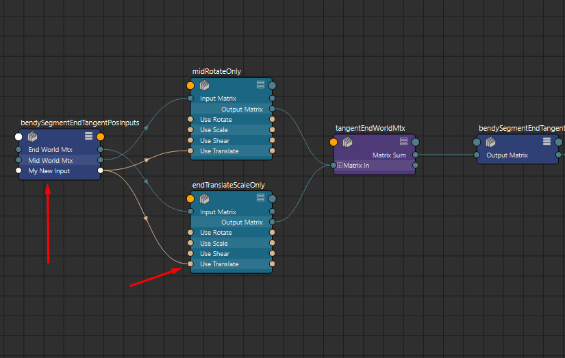
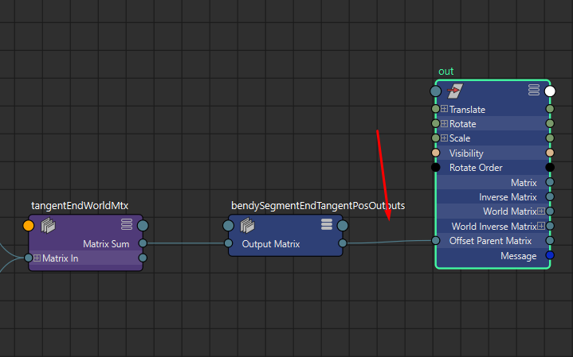
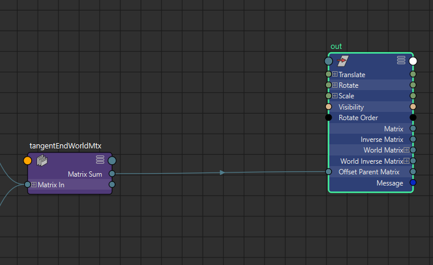

NamedGraphs
###########

You can think of Named Graphs as Bifrost Compounds for Maya Native nodes.
Where you create a Node Graph in Maya as Save it out as a reusable node graph in Json Format.
These Graphs can be loaded back in any time and edited then saved anytime(:ref:`See Example<NamedGraphs_example>`).

.. _NamedGraphs_example:

Example
-------
Lets first have a look at a simple maya graph we're going save to json

We have 3 nodes in the center which we want to save.

First select them

Now run the following to convert them to a simple dict which provides the ID and the node instance.

.. note:: While here we're simply using the node name for the id, you can however use any id you would like.

.. code-block:: python

    from zoo.libs.maya import zapi
    from zoo.libs.hive.base.serialization import dggraph
    nodes = {i.name(includeNamespace=False): i for i in zapi.selected()}

Now lets create some inputs and outputs for our graph

.. code-block:: python

    inputs = {"startMtx": nodes["midRotateOnly"].inputMatrix,
              "endMtx": nodes["endTranslateScaleOnly"].inputMatrix}
    outputs = {"outputMatrix": nodes["tangentEndWorldMtx"].matrixSum}

Now lets create a graph instance with our scene data and serialize to a dict read to save

.. code-block:: python

    graph = dggraph.NamedDGGraph("ourGraphId", nodes,
                                 inputs=inputs,
                                 outputs=outputs)

.. note:: "ourGraphId" is quite important as this is used as the registered Id for later retrieval

Now save to the registry

.. code-block:: python

    from zoo.libs.hive import api

    outputPath = api.Configuration().graphRegistry().saveGraph("ourGraphId", graph)

Alright we've seen how to save a maya graph out, now let's recreate it and have a look at some nifty options.

.. code-block:: python

    from zoo.libs.hive import api
    dataGraphRep = api.Configuration().graphRegistry().graph("ourGraphId")
    sceneGraph = api.serialization.NamedDGGraph.create(dataGraphRep)

We've now created the graph but don't you think it would be nice to have inputs/outputs of the graph as
specialized nodes for easier troubleshooting and editing? Well lets do that.

.. code-block:: python

    sceneGraph.createIONodes()

As you can see we now have a input node(left) and a output node(right).
This is great for editing our graph and troubleshooting our connections.

Now lets add a new input just for our demo, also you can use `addOutput` method as well.

.. code-block:: python

    sceneGraph.addInput("myNewInput", sceneGraph.node("midRotateOnly").useTranslate)
    sceneGraph.addInput("myNewInput", sceneGraph.node("endTranslateScaleOnly").useTranslate)

Here we add one inputAttribute by connected to 2 internal attributes using the helper method
`sceneGraph.node` which retrieves a node by it's ID.

At this point we can re-save the graph

.. code-block:: python

    outputPath = api.Configuration().graphRegistry().saveGraph("ourGraphId", graph)

Now lets delete the IO nodes so we don't incur any runtime performance hits. But lets first
connect the output to a transform so you can see that you can create/edit and clean the graph at
any time.

Now delete.

.. code-block:: python

    sceneGraph.deleteIONodes()

