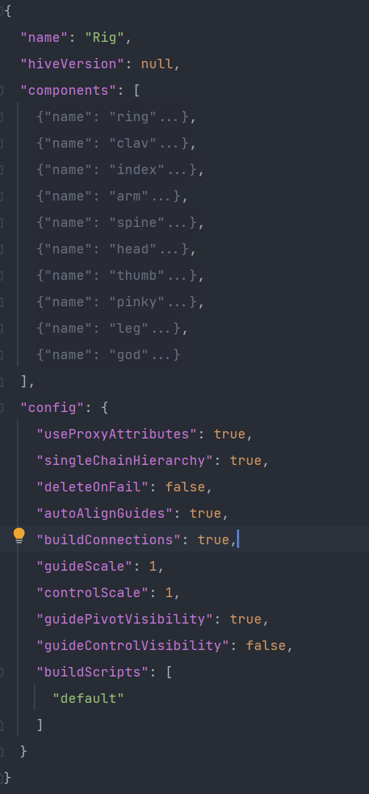
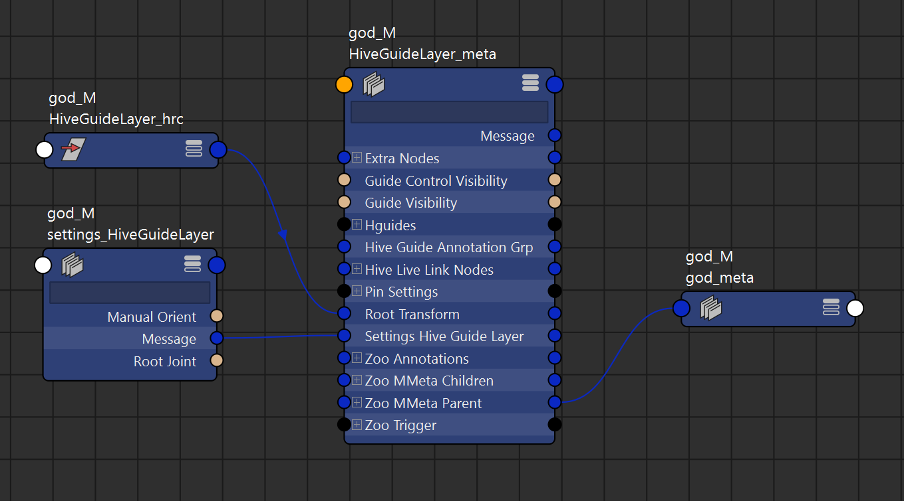

Terminology
########################################

Hive is a modular rigging framework that introduces several terms and concepts that are
essential to understanding its functionality and capabilities.
However, some of these terms may have different meanings depending on the context,
while others may already be familiar to users from other applications.
This document serves to define and explain all major concepts used in Hive's documentation.

.. contents:: Table of Contents
   :local:
   :depth: 2

.. _component-term:

Component
========================================

A component is a self-contained part of a larger rig, such as an arm, leg, or eye.
These components can be combined to create more complex rigs. They are designed to be modular,
so if you find yourself reusing the same rigging logic multiple times,
you can make it into a component and attach it to other components.
Hive provides pre-built components for common use cases, and we are constantly adding more.
Check out the :ref:`component-reference` for more information on how to create and use components.

.. _definition-term:

Definition
========================================

Definition files are used by Hive to automatically generate scene data,
including nodes and attributes, based on the information provided in the file.
They contain a hierarchy of the component guide, animation attributes such as IK/FK,
metadata, IO nodes and attributes. These files are written in JSON format,
which makes them easy to debug and edit. Without a component definition file,
you cannot create a functioning component. These files are the primary way to create guides,
joints, and other necessary components.
It is essential to have a properly defined component to ensure that it works in all possible scenarios.
For more information, refer to the :class:`zoo.libs.hive.base.definition.ComponentDefinition` API reference.

.. _template-term:

Template
========================================

Hive Templates are Json Files or Raw Python Dictionary data.

The Data inside of a template contain the custom configuration overrides, final composed guide definition,
rig name and hive version that was used to create the template.
With this information it allows hive to recreate any hive rig from scratch.

.. _hiveLayers-term:

Hive Layers
===========

Hive Layers are based on a Organizational concept. Each Layer represents a collection of nodes
and attributes. Each Layer is responsible for construction, serialization and querying it's own
data.

Each layers always consists of two primary nodes

    #.. The metaNode(Maya network node).
        * Links all nodes within the layer.
        * Handles all API queries and meta Data.

    #. Dag Transform.
        * Contains all Dag nodes for the layer. The exception is the Deform Layer at the component
          level where bind joints are parented to the rig Layer deform.

Hive Layers aren't display or render layers though they share similarities in the concept of the API.

.. _guideLayer-term:

Guide Layer
-----------

A Hive Guide layer is a container for all guide related nodes within a single component
It contains all API logic for Querying, creating, deleting guides.
It's responsible for (de)serialization of the guide hierarchy for definitions/templates.
The guide layer also contains all primary build settings which the user can change in a UI
via a connected node called a "Settings Node" which are network nodes with attributes.

|

API Reference: :class:`zoo.libs.hive.base.hivenodes.layers.HiveGuideLayer`

.. _rigLayer-term:

Rig Layer
---------

The Rig Layer is responsible for the animation control rig and animation settings(attributes).
Just like all other Hive Layers is contains all API logic related to Animation controls, system joints(ik/fk).
This layer also contains all animation extra attribute like ik/fk stretch etc on a connected network node
called the "ControlPanel". All extra attributes on this node will become proxy attributes on all controls
on the component.

|

API Reference: :class:`zoo.libs.hive.base.hivenodes.layers.HiveRigLayer`

.. _deformLayer-term:

Deform Layer
------------

The Deform Layer is responsible for managing deformation joints ie. joints which are skinned to
output geometry,  deformers would be parented to this layer on the component level as well ie. lattice.
This layer exists at the rig level and the component, use the component deform layer to access the joints.
The Rig root deform Layer is used for parenting.

|

API Reference: :class:`zoo.libs.hive.base.hivenodes.layers.HiveDeformLayer`

.. _inputLayer-term:

Input Layer
-----------
The input layer is responsible for managing the incoming transforms from outside of the component, for example
when a constraint happens from one component to another. Instead of constraining the control directly from another
component we constraint a input node which in turn manipulates the component this allows the internals of the component
to be self contained and have complete control over how the node network is managed.

|

API Reference: :class:`zoo.libs.hive.base.hivenodes.layers.HiveInputLayer`

.. _outputLayer-term:

Output Layer
------------
Similar to the Input Layer the Output layer manages all outgoing transforms which in turn constrains the input layer of
another component.

|

API Reference: :class:`zoo.libs.hive.base.hivenodes.layers.HiveOutputLayer`

.. _xGroupLayer-term:

XGroup Layer
------------
A Extra group which rigs can use at the component level to manage arbitrary nodes, this layers
is not build automatically as it's not always needed.

|

API Reference: :class:`zoo.libs.hive.base.hivenodes.layers.HiveXGroupLayer`

.. _componentLayer-term:

Component Layer
---------------
The Component layer that only exists at the root of a Rig which manages all components this is
how we access a component through the rig. The Layer just like the others contain
a transform however all components will be parented too this transform.

|

API Reference: :class:`zoo.libs.hive.base.hivenodes.layers.HiveComponentLayer`

.. _geometryLayer-term:

Geometry Layer
--------------
The Geometry layer manages all geometry on a rig ie. both proxy which some people call the calamari and
deformed geometry. The Geometry can exist at both the Rig root level and the component level. The Default
Rig root level is where all geometry which would be exported gets parented too.

|

API Reference: :class:`zoo.libs.hive.base.hivenodes.layers.HiveGeometryLayer`

.. _guide-term:

Guide
-----

A Hive Guide Represent to main areas first the Transform which will be referenced
by all other aspects of a component to generate nodes calculate math etc.
Second is the Animation control shape which can be manipulated by the rigger before
it's serialized and applied to the animation control shape.