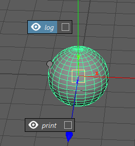

.. _markingmenu-api-example:

Creating Triggers
#######################

Zoo provides a framework to build you're own marking menus and node based triggers.

This Page is going to walk you through the process of creating a custom marking menus
and a selection trigger.

.. contents:: Table of Contents
   :local:
   :depth: 1

What is a Trigger
=================

A trigger is a plugin which gets executed for a given node when the user either selects the node(s)
or right clicks a node. When selection occurs for multiple nodes ie. cmds.select([node1, node2])
If there's multiple nodes with a trigger attached then each trigger found will be executed one at a time so
it's very important to have as optimised code as possible and to avoid using selection triggers to run
performance intensive code.

When a trigger is executed for a node, the type of trigger depends on the meta data applied to the node.
There are 2 commonly used types.

#. A marking menu.
#. Selection trigger which can change the selection or can run some python code.

What you will learn
===================

#. Attach a Trigger to any node for display a marking menu on rmb click.
#. Create a static marking menu via json.
#. Create a dynamic marking menu via python.
#. Create a selection trigger.

To access the code examples in this tutorials to can find them in the below folder
inside the zoo_maya package.::

    zoo_maya/examples/markingmenus/

Creating a Marking Menu
=======================

Creating a static menu layout
-----------------------------

First we're going to show how to create a static marking menu which will provide a
good understanding of how marking menus are structured in it's raw serialized form.
This same structure will be used in our dynamic code driven approach.

A static marking menu is quite useful when you don't have varying layout and you
wish to reduce the amount of code and human error.

This static layout is built in Json form and describes what commands to display each
action. This includes support for the N,S,E,W.

Lets look at the final result in Maya.

Now lets see the json data which describes the above.

.. code-block:: json

    {
      "items": {
        "N": {
          "type": "command",
          "id": "printNodePath",
          "arguments": {
            "operation": "log"
          }
        },
        "generic": [
          {
            "type": "command",
            "id": "printNodePath"
          }
        ]
      },
      "id": "example.layout.id"
    }

You can see from the above that the layout lives under the "items" key and that each item or action
is described with the below

.. code-block:: json

    {
          "type": "command",
          "id": "printNodePath",
          "arguments": {
            "operation": "log"
    }

Now lets understand what each key here means and what other options we've got.

For each command type we have the following.

.. list-table::
   :widths: 25 50
   :header-rows: 1

   * - Key
     - Description
   * - type
     - The type word basically says what action type is this. "command" is the most used but
       "separator" is used what you need a visual separation between actions.
   * - id
     - Required when the type is a "command" it's always the command id to use.
   * - arguments
     - Optional key which passes any user arguments to the command.
   * - label
     - override to the command label which is specified in code.
   * - icon
     - override to the command icon which is specified in code, icon value is a name from our iconlib.

You'll also find theres a `id` key with the value "example.layout.id", This is the alias for the layout and
we be added to any nodes our create the trigger on so it's important that "id" values are set once and never changed.

Create A Menu Command
---------------------

At this point we've got a general understanding of how the layout is structured. Lets move on the implementing
the python commands which will run when the user clicks on an action.

First create a new python file or feel free to just reuse our example.py in the examples/markingmenus folder.

Copy and paste the below code into the python file

.. code-block:: python

    from zoo.libs.maya.markingmenu import menu
    from zoo.core.util import zlogging

    logger = zlogging.getLogger(__name__)

    class PrintNodePath(menu.MarkingMenuCommand):
        """Example Command class which demonstrates how to dynamically change the UI Label and to have
        a UI.
        Specifying a Docstring for the class will act as the tooltip.
        """
        # a unique identifier for a class, once released to public domain this
        # id should never be changed due to being baked into the maya scene.
        id = "printNodePath"
        # The developers name must be specified so tracking who created it is easier.
        creator = "Zootools"

        @staticmethod
        def uiData(arguments):
            op = arguments.get("operation")
            return {"icon": "eye",
                    "label": "log" if op else "print",
                    "bold": False,
                    "italic": True,
                    "optionBox": True,
                    "optionBoxIcon": "eye"
                    }

        def execute(self, arguments):
            """The execute method is called when triggering the action item. use executeUI() for a optionBox.

            :type arguments: dict
            """
            operation = arguments.get("operation", "")
            currentNodes = arguments.get("nodes")
            if operation == "print":
                for n in currentNodes:
                    print(n.fullPathName())

            elif operation == "log":
                for n in currentNodes:
                    logger.info(n.fullPathName())
            else:
                for n in currentNodes:
                    print(n)

        def executeUI(self, arguments):
            """The executeUI method is called when the user triggering the box icon on the right handle side
            of the action item.

            For this method to be called you must specify in the UIData method "optionBox": True.

            :type arguments: dict
            """
            operation = arguments.get("operation", "")
            if operation == "print":
                currentNodes = arguments.get("nodes")
                for n in currentNodes:
                    print(n.fullPathName())

The above code provides everything needed to have a functioning menu but lets break the parts which are
important.

First The class variable `id`

.. code-block:: python

    id = "printNodePath"

The id for the command "printNodePath" will be registered and is the one specified in the layout file.

To tell the menu to display in a certain way we use the uiData staticmethod which is run just before the menu
is displayed and returns a dict, this is where you would write anything that may change the display ie. the label.
In our case we use the operation argument to change the label between "log" and "print"
The `arguments` passed to the command are the ones provided in the layout file like below

.. code-block:: json

    "arguments": {
            "operation": "log"

To run some code when the user clicks the action we re-implement the execute() function and based
on the argument we provided the layout file called "operation" we either print to the console or
use logging as a basic demonstration.

What is also shown in the command code is that we refer to an argument key called "nodes" which is provided
by our underlying bootstrap code for the marking menu, the value equals the current node under the mouse pointer
and the current selection.

With everything we have built so far we can now register our layout and command.

Zoo discovers commands and layouts when the user first attempts to right click in the viewport on a node
which contains a trigger, this is done through our plugin system which the marking menu base has created a
unique instance of. Our Plugin system mainly works via environment variables, knowing this we need to add to
2 environment variables to your zoo_package.json

Note::

    It's possible to reload the marking menu plugin registry manually see :ref:`API Reference<markingmenu-api>`

The 2 environment variables are the below, for our example we'll path to our example folder in our zoo_package.json

.. code-block:: json

     "ZOO_MM_COMMAND_PATH": [
            "{self}/examples/markingmenus"
        ],
     "ZOO_MM_LAYOUT_PATH": [
        "{self}/examples/markingmenus"
     ],

Note::

    It's important to note here we path to the folder on the files in this way the plugin system will search
    recursively through the subfolders and files loading any python classes and `.mmlayout` files which match our system.

Now reload zoo via our developer shelf or menu.
Once reloaded do the following

#. Go the the python script editor in Maya.
#. Run the below python code.

    .. code-block:: python

        from zoo.libs.maya import triggers
        from zoo.libs.maya import zapi
        triggerNode = zapi.selected(filterTypes=((zapi.kNodeTypes.kTransform, )))
        layoutId = "example.layout.id" # Defined by us in Step 2A
        triggers.createMenuTriggers(triggerNode, menuId=layoutId)

#. Right click the node in the viewport and you should now see the below.

This is now everything you need to know for creating a static marking menu but lets create the
same menu but this time via code which provides greater control and is how we create our Menus in :ref:`Hive<hive-api>`

Creating a dynamic marking menu
-------------------------------

To create a Dynamic menu we can keep the existing command class we've created which is the great thing about
having a plugin system...reuse!.

Create a new python file in a folder which also contains a __init__.py or just reuse ours(examples.py).

The code looks like the below.

.. code-block:: python

    class DynamicMMBySelectionExample(menu.MarkingMenuDynamic):
        """Example Class for dynamically creating marking menus.
        """
        # a unique identifier for a class, once release to public domain this
        # id should never be changed due to being baked into the maya scene.
        id = "dynamicMMBySelectionExample"

        def execute(self, layout, arguments):
            """Example override creating a linear menu with passing arguments down to the MMCommands.

            :param layout: The layout instance to update.
            :type layout: :class:`menu.Layout`
            """
            # grab the nodes value which comes from the marking menu executor
            selNodes = arguments.get("nodes")
            if not selNodes:
                return
            # build a dict which contains our commands
            # each command must be specified in the format of {"type": "command", "id": "mycommandid"}
            items = {"N": {
                    "type": "command",
                    "id": "printNodePath",
                    "arguments": {
                        "operation": "log"
                    }
                },
                "generic": [
                    {
                        "type": "command",
                        "id": "printNodePath"
                    }
                ]}

            # finally update the layout object
            layout["items"] = items
            # ensure the layout has been solved to contain our commands
            return layout

You can see that we create the exact same menu via a dict and update the layout object, Pretty straight forward.
However theres a couple things you can do here that a static menu can't.

#. You can add and remove any action based on scene state or nodes provided.
#. You can include python objects as part of the command actions arguments key.

From here we just need to update or add another environment to our zoo_package.json just like before.

.. code-block:: json

    "ZOO_MM_MENU_PATH": [
                 "{self}/examples/markingmenus"
    ],

Now reload zoo and this time create a new sphere and select it then run the below.

.. code-block:: python

    from zoo.libs.maya import triggers
    from zoo.libs.maya import zapi
    from zoo.libs.maya.markingmenu import menu
    triggerNode = zapi.selected(filterTypes=((zapi.kNodeTypes.kTransform, )))
    layoutId = "dynamicMMBySelectionExample" # Defined by us in Step 2A
    triggers.createMenuTriggers(triggerNode, menuId=layoutId)

You can we just change the layoutId to our `id` value on the menus class.

There you have that's the basics of creating a marking menu.

Create a Selection Trigger
==========================

Since you now know how to create a marking menu lets move onto create a Selection Trigger.

What is a Selection trigger
---------------------------

A selection trigger is a plugin which gets executed for a given node when the user selects the node(s)
When a trigger is executed for a node the type of trigger depends on the meta data applied to the node.
There are 2 commonly used types.

#. A marking menu, What we just built above.
#. Selection trigger which can change the selection or can run some python code.

Lets cut to the end and show the code to attach a selection trigger which prints helloworld and
selects a transform as a connectable.

.. code-block:: python

    from zoo.libs.maya import triggers
    from zoo.libs.maya import zapi
    from zoo.libs.maya.markingmenu import menu

    triggerNode = zapi.selected(filterTypes=((zapi.kNodeTypes.kTransform, )))
    selectableNode = zapi.createDag("selectable", "transform")

    triggers.createSelectionTrigger(triggerNode,
     commandStr='print("helloworld")',
     connectables=[selectableNode],
     triggerCommandId=None
     )

To run the above test a new node in the scene, lets make it another sphere and select it then
run the code.

If you now try selecting the new sphere you created the transform will be selected instead and
"helloworld" will be printed as well.

It's as simple as that when it comes to selection triggers.

Now you're probably asking can you create you're own selection trigger plugins and the answer is absolutely!.
While it's possible to just feed the code as a string into the commandStr argument but
without a UI(which we've yet to build) to help with the string formatting it's very error prone.

So lets create our own which simply prints all connectable nodes.

First create a new python file or just reuse our example under the examples/triggers example folder.

This is what the code looks like.

.. code-block:: python

    from zoo.libs.maya import triggers

    class CustomSelectionTrigger(triggers.TriggerSelectionBase):
        id = "customExampleTrigger"

        def execute(self):
            # at this point before or after super we can run any code.
            print([i for i in self.connectedNodes()])
            # by calling super we ensure the custom python command on the node gets executed
            super(CustomSelectionTrigger, self).execute()

Once again we have the id class variable which we will add to the node on trigger creation.
Then we simply re-implement the `execute()` function. Calling super here will use execute any
python code passed through on creation via the `commandStr` argument.

Connectables is a list of nodes which are attached to the trigger node.

Now update the zoo_package.json file with the below.

.. code-block:: json

    "ZOO_TRIGGER_COMMAND_PATH": [
        "{self}/examples/triggers"
    ]

Now do the following.

#. Reload zoo
#. Create a new node which will be a selection trigger.
#. Run the below, passing our command id to the `triggerCommandId` argument

    .. code-block:: python

        from zoo.libs.maya import triggers
        from zoo.libs.maya import zapi
        from zoo.libs.maya.markingmenu import menu

        triggerNode = zapi.selected(filterTypes=((zapi.kNodeTypes.kTransform, )))
        selectableNode = zapi.createDag("selectable", "transform")

        triggers.createSelectionTrigger(triggerNode,
         commandStr='print("helloworld")',
         connectables=[selectableNode],
         triggerCommandId="customExampleTrigger"
         )

#. Select the new node you created on step 2 and now check the script editor.
   You find that the below was printed out.::

    [<DagNode>selectable]
    helloworld

We now have extended trigger commands with our own plugin which can react anyway you wish.

That's it for this tutorial.

Happy coding.