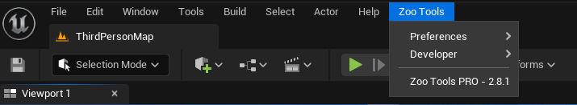

Zoo Unreal
==========

This is the Unreal Engine package similar to `zoo_maya` package where it contains the framework code.
The package contains the Main Menu for Unreal. However the bootstrapping and Host engine is contained in
the main installation core of Zoo.

    :colorlightgrayitalic:`ZooTools Menu In Unreal.`

.. Note::
    Unreal Integration at this point in time is very basic and doesn't come with Artist Tools just yet,
    however it does come with the ZooTools Menu and the ability to write you're own tools.

.. Note::
    Primary Limitation of Zoo Unreal is we've yet to port some Widgets over from maya to Unreal notably
    the color widgets so you may find some parts in UIs not displaying correctly. This is will be fixed in
    later version.

.. toctree::
    :maxdepth: 2

    ./installation
    ./changelog
