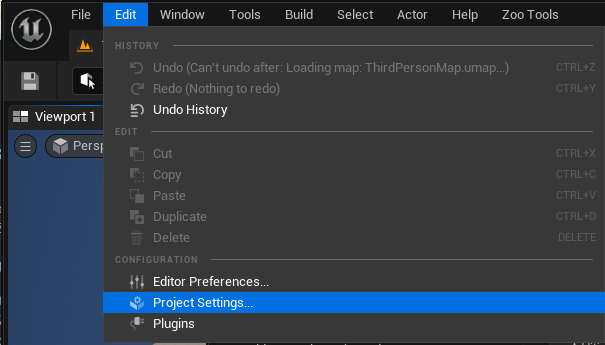
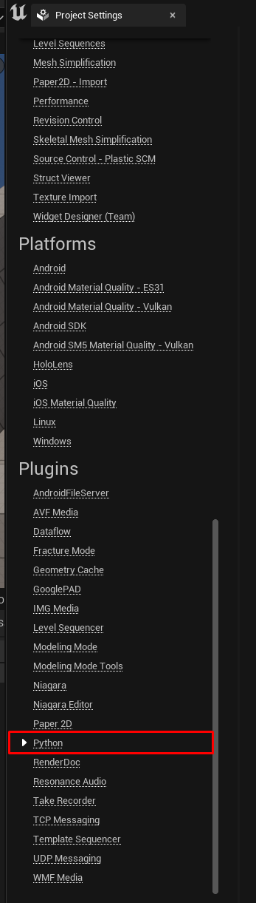
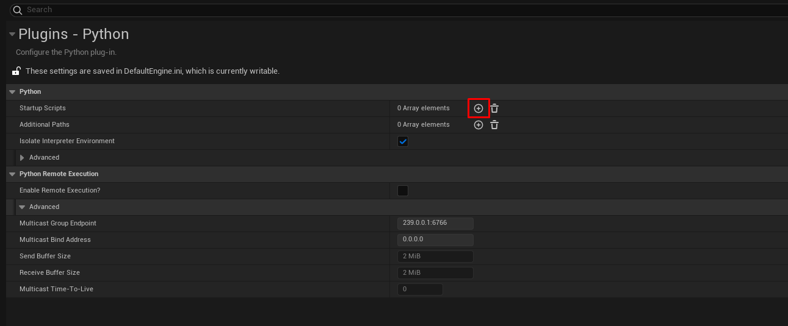
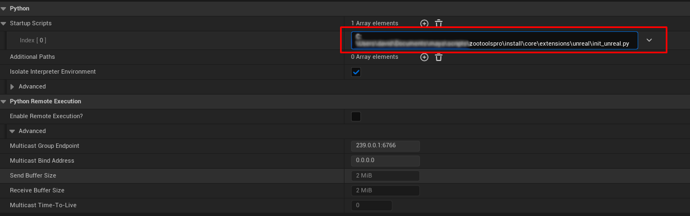

============
Installation
============

The following steps outline the installation process for integrating Zoo Tools into Unreal Engine.

Before you begin, ensure that you have the following:

- A compatible version of Unreal Engine installed on your system. We've tested Unreal engine 5.2+.
- A Zoo Tools installation on your system. Zoo unreal requires Zoo 2.8.1+

To get ZooToolsPro to work in Unreal you need to have the following Unreal plugins enabled.

- Python Editor Script Plugin.

Make sure to restart Unreal after enabling the Unreal plugins.

Next we simply need to specify to path to the unreal init_unreal.py found in Zoo installation
in your project settings.

.. note:: The path needs to be set for each Unreal project separately.

#. First go to the Project Settings Window under the Edit Menu.

    :colorlightgrayitalic:`Go To Project Settings.`

#. Next go to the Python section in the Project Settings Window.

    :colorlightgrayitalic:`Find Python in the Left Hand View.`

#. Find the section called startup scripts and click the Plus button to add a new startup script.

    :colorlightgrayitalic:`Click Add.`

#. Now Add the path to the init_unreal.py file found in your Zoo Tools installation.

    :colorlightgrayitalic:`Add the path to the init_unreal.py file found in your Zoo Tools installation.`

#. Now Restart Unreal and you should see the Zoo Tools Menu in Unreal.

.. figure:: resources/installMenu.png
    :align: center
    :alt: alternate text
    :figclass: align-center

    :colorlightgrayitalic:`ZooTools Menu In Unreal.`
